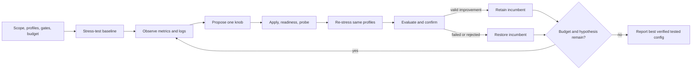

# Inference Engineering plugin

Install one bundle, then invoke individual skills or the full experiment workflow.
This source directory contains manifests, command aliases and focused agent specs;
the builder assembles it with the canonical skills into a self-contained plugin.

| Entry point | Skill | Responsibility |
|---|---|---|
| `stress-test` | inference-stress-testing | Reproducible endpoint load, raw reports, evaluation |
| `observe` | inference-observability | Ray state, windowed metrics, logs and Grafana review |
| `tune` | ray-autotune-inference | Config proposals, Ray apply/readiness/rollback |
| `optimize` | inference-optimization | Fixed-profile, bounded tune-test-evaluate loop |

Each skill is also selectable directly. The coordinator can use five narrow roles:
coordinator, benchmarker, observer, tuner and evaluator. The tuner proposes; one
coordinator writes. Observation may run alongside one load test. Read-only review
can be parallel; competing load or deployment changes cannot.



## GitHub Copilot CLI first

From the repository root:

```bash
python3 ./scripts/build_plugin.py --output dist/copilot/inference-engineering --zip
```

Build writes a new plugin directory and adjacent ZIP, excluding env files, configs,
run artifacts, caches and Git metadata. Existing outputs are refused. Canonical
skill source remains at the repository root; edit it there and rebuild. The build
includes hashes for payload integrity and Copilot/Codex marketplace files in the
output parent. It does not install, enable, publish or connect the plugin.

The default build uses Copilot's established manifest with explicit skills,
commands and agent paths. It emits five `.agent.md` files for native discovery.
Start with a session-local mount (no persistent plugin installation):

```bash
copilot --plugin-dir ./dist/copilot/inference-engineering
```

In the session, inspect `/plugin`, `/skills` and `/agent`. Copilot 1.0.93 discovery
lists command aliases as `optimize`, `stress-test`, `observe` and `tune`; use the
actual slash-command completions shown in your session. Namespaced spellings are
host-dependent. A direct natural-language request such as “Use
inference-optimization to create an offline plan” also selects the canonical skill.
The four skills are independently discoverable too.
Check for same-name project or personal skills/agents, which take precedence over
plugin definitions; use a clean workspace for the first smoke test.

A safe first prompt is: “List this plugin's four skills and five agents, explain
the workflow, and produce an offline plan. Do not contact endpoints, send load or
change any deployment.” Then test a single configured stress profile before a live
optimization loop. Keep permissions scoped; blanket tool auto-approval is unnecessary.

For persistent installation after the mount test, prefer the generated marketplace
(Copilot 1.0.93 warns that direct local installs will be deprecated):

```bash
copilot plugin marketplace add ./dist/copilot
copilot plugin install inference-engineering@inference-engineering-local
copilot plugin list
```

Copilot CLI is the primary target. A new optional `--format portable` build emits
Agent Plugins 1.0 and moves Copilot-specific discovery to `com.github.copilot/`.
Use a different fresh output root for that build. Codex loads the same four skills
through its compatibility manifest; select `$inference-optimization`. Native agent
registration is not claimed for Codex.

For Codex, add the generated marketplace root via the documented local marketplace
mechanism, then use the desktop Plugins Directory to install/test:

```bash
codex plugin marketplace add ./dist/copilot
```

See the [Copilot validation record](references/copilot-validation.md). Build structure,
payload links, Python tools and offline behavior are tested. These are distinct
from live Ray access and real-model optimization validation.

## Runtime

The plugin itself needs Python 3.10+ for its tools. Live stress tests additionally
need Docker Compose, the pinned GuideLLM image, a reachable endpoint and matching
tokenizer. Ray mutation needs authorized dashboard/config access; telemetry/log
sources have their own optional credentials. All credentials are runtime inputs.

Use a writable experiment workspace. If the installed plugin is read-only, copy
all bundled skill folders together into a private working directory to preserve
sibling imports; put `.env`, configs and artifacts there. Do not edit the plugin
cache. No hook silently runs load or changes deployments on installation.

The optimization loop is agent-guided; scripts automate collection, control and
comparison, while hypotheses, log/panel review and the ledger are agent work.
Convergence means a documented stopping rule over tested candidates. Neither a
plateau nor the throughput comparison certifies a global optimum. NVIDIA Dynamo
is a future control/telemetry adapter; Ray is implemented first.

References: [Deep Wiki inspiration](https://github.com/microsoft/skills/blob/main/.github/plugins/deep-wiki/README.md),
[Copilot plugin packaging](https://docs.github.com/en/copilot/how-tos/copilot-cli/customize-copilot/plugins-creating),
[OpenAI plugin packaging](https://developers.openai.com/plugins/build/plugins), and
[OpenAI command/agent portability](https://developers.openai.com/plugins/guides/submit-claude-plugin).
